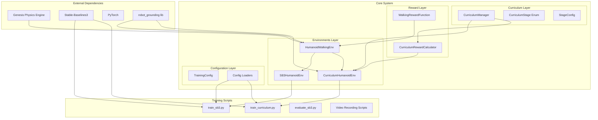
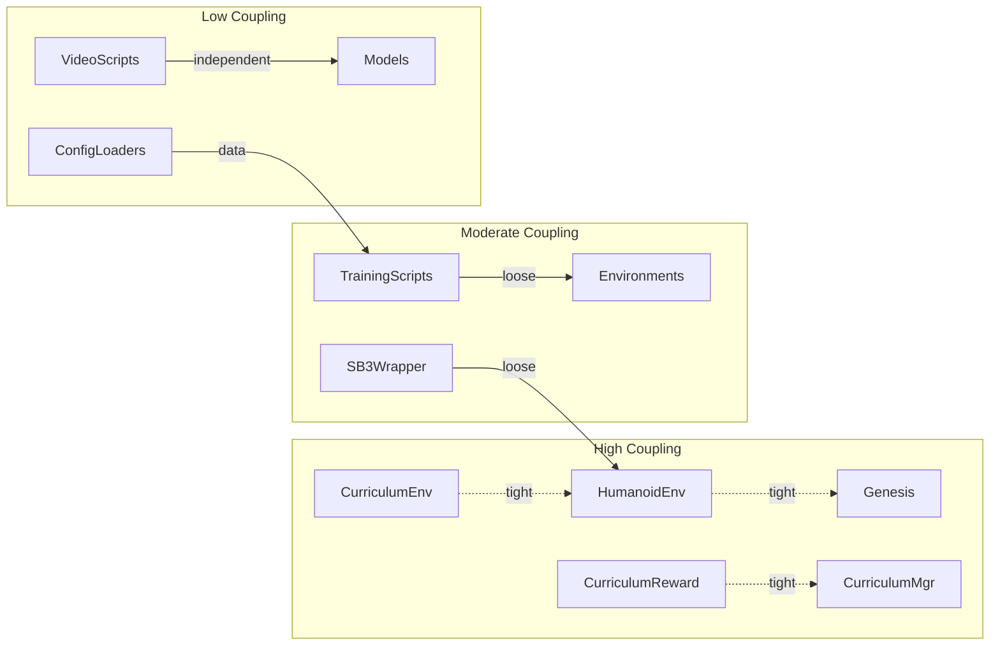
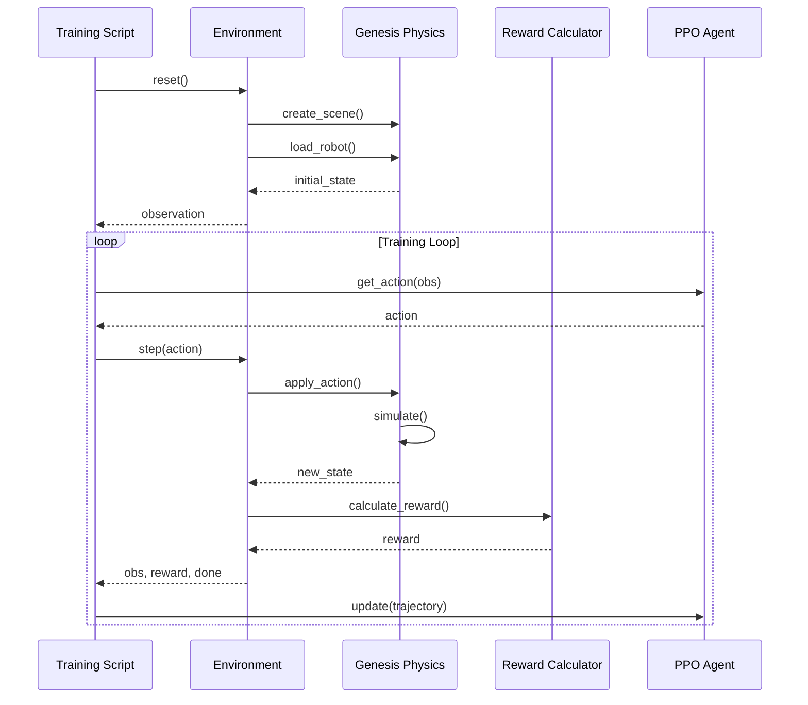
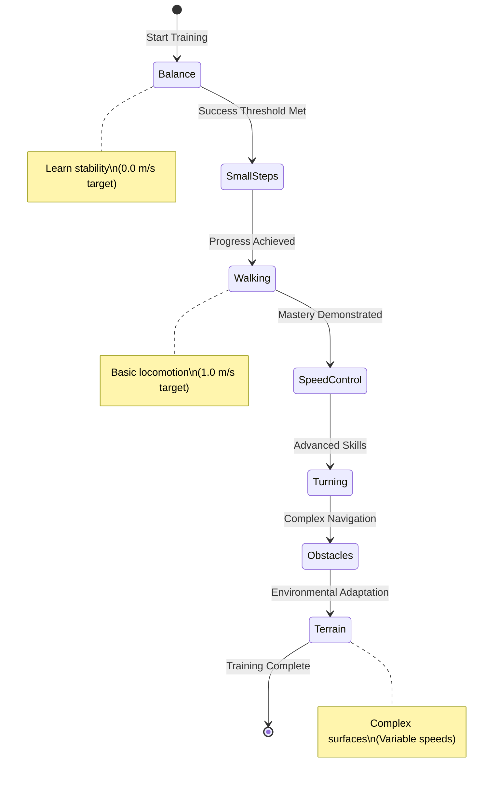

# Architectural Analysis of genesis_humanoid_rl

## Executive Summary

The genesis_humanoid_rl project is a reinforcement learning framework for training humanoid robots to walk using the Genesis physics engine and Stable-Baselines3. The architecture demonstrates a well-structured, modular design with clear separation of concerns, though there are several areas for improvement in terms of coupling, abstraction, and system boundaries.

## 1. System Architecture Overview

### High-Level Architecture Diagram



## 2. Architectural Patterns Identified

### 2.1 Layered Architecture
The system follows a layered architecture with distinct responsibilities:
- **Environment Layer**: Handles physics simulation and robot control
- **Curriculum Layer**: Manages progressive difficulty training
- **Reward Layer**: Calculates performance metrics
- **Configuration Layer**: Manages experiment parameters
- **Training Layer**: Orchestrates the training process

### 2.2 Adapter Pattern
- `SB3HumanoidEnv` acts as an adapter between the custom environment and Stable-Baselines3 requirements
- Ensures compatibility without modifying the base environment

### 2.3 Strategy Pattern
- Reward calculation uses strategy pattern with `WalkingRewardFunction` and `CurriculumRewardCalculator`
- Allows switching between different reward strategies

### 2.4 Template Method Pattern
- Base environment (`HumanoidWalkingEnv`) defines the structure
- `CurriculumHumanoidEnv` extends and customizes specific behaviors

## 3. Component Relationships and Dependencies

### 3.1 Core Dependencies Graph



### 3.2 Coupling Analysis

**Tight Coupling Issues:**
1. **Path Manipulation**: Direct `sys.path` manipulation in multiple files creates fragile import dependencies
2. **Genesis Integration**: Direct Genesis API calls throughout environments without abstraction layer
3. **Reward-Environment Coupling**: Reward functions directly access robot internal state

**Loose Coupling Successes:**
1. **Configuration System**: Well-isolated with dataclasses and JSON serialization
2. **SB3 Wrapper**: Clean adapter implementation
3. **Training Scripts**: Minimal dependencies on implementation details

## 4. Data Flow and Control Flow

### 4.1 Training Data Flow



### 4.2 Curriculum Progression Flow



## 5. System Quality Attributes

### 5.1 Performance
- **Strengths**: 
  - Efficient physics simulation (100+ FPS target)
  - Parallel environment support in SB3
  - Optimized reward calculations
- **Weaknesses**:
  - Single environment for curriculum (no parallelization)
  - Synchronous video recording blocks training

### 5.2 Scalability
- **Horizontal**: Limited by curriculum's single-environment constraint
- **Vertical**: Good GPU utilization through Genesis
- **Recommendation**: Implement distributed curriculum with synchronized progression

### 5.3 Maintainability
- **Strengths**:
  - Clear module separation
  - Comprehensive documentation
  - Type hints throughout
- **Weaknesses**:
  - Hard-coded paths and constants
  - Tight coupling to Genesis API
  - Limited abstraction layers

### 5.4 Extensibility
- **Adding new robots**: Requires modifying environment classes
- **New reward functions**: Well-supported through strategy pattern
- **New training algorithms**: Limited to SB3-compatible algorithms

## 6. Architecture Anti-Patterns Present

### 6.1 God Object
- `HumanoidWalkingEnv` has too many responsibilities:
  - Physics simulation management
  - Robot control
  - Observation extraction
  - Reward calculation
  - Termination checking

### 6.2 Hardcoded Dependencies
```python
# Multiple instances of:
project_root = os.path.dirname(os.path.dirname(os.path.dirname(os.path.dirname(os.path.abspath(__file__)))))
sys.path.insert(0, project_root)
```

### 6.3 Leaky Abstractions
- Genesis tensor types leak through to reward calculations
- Direct access to robot internal state from multiple components

### 6.4 Missing Interfaces
- No abstract base classes for environments
- No interface definitions for reward functions
- Direct concrete class dependencies

## 7. Recommended Architecture Decision Records (ADRs)

### ADR-001: Physics Engine Abstraction Layer
**Status**: Proposed  
**Context**: Direct Genesis API usage creates tight coupling  
**Decision**: Introduce physics abstraction interface  
**Consequences**: Easier testing, potential multi-engine support

### ADR-002: Dependency Injection for Rewards
**Status**: Proposed  
**Context**: Reward functions are tightly coupled to environments  
**Decision**: Use dependency injection pattern for reward calculators  
**Consequences**: Better testability, easier reward function swapping

### ADR-003: Event-Driven Curriculum Progression
**Status**: Proposed  
**Context**: Curriculum progression is tightly integrated with environment  
**Decision**: Implement event system for curriculum state changes  
**Consequences**: Decoupled curriculum logic, better monitoring

### ADR-004: Configuration Schema Validation
**Status**: Proposed  
**Context**: JSON configs lack validation  
**Decision**: Implement Pydantic models for configuration validation  
**Consequences**: Runtime validation, better error messages

## 8. Improvement Opportunities

### 8.1 Immediate Improvements
1. **Abstract Physics Interface**
   ```python
   class PhysicsEngineInterface(ABC):
       @abstractmethod
       def create_scene(self, config: SceneConfig) -> Scene:
           pass
       
       @abstractmethod
       def step_simulation(self, dt: float) -> None:
           pass
   ```

2. **Environment Factory Pattern**
   ```python
   class EnvironmentFactory:
       @staticmethod
       def create_environment(
           env_type: str,
           physics_engine: PhysicsEngineInterface,
           reward_calculator: RewardCalculatorInterface,
           **kwargs
       ) -> gym.Env:
           pass
   ```

3. **Proper Package Structure**
   - Use `__init__.py` exports instead of sys.path manipulation
   - Create proper package installation with setup.py

### 8.2 Medium-term Improvements
1. **Implement Domain Events**
   - CurriculumStageChanged event
   - EpisodeCompleted event
   - TrainingMilestone event

2. **Separate Concerns in Environments**
   - PhysicsSimulator component
   - ObservationExtractor component
   - ActionProcessor component

3. **Implement Repository Pattern for Models**
   - Model storage abstraction
   - Versioning support
   - Cloud storage integration

### 8.3 Long-term Architectural Evolution
1. **Microservices Architecture**
   - Separate physics simulation service
   - Training orchestration service
   - Model serving service

2. **Plugin Architecture**
   - Pluggable reward functions
   - Pluggable robots
   - Pluggable training algorithms

## 9. Conclusion

The genesis_humanoid_rl project demonstrates solid foundational architecture with clear module separation and good use of design patterns. However, there are significant opportunities for improvement in terms of:

1. **Reducing coupling** through abstraction layers
2. **Improving testability** through dependency injection
3. **Enhancing scalability** through better parallelization support
4. **Increasing flexibility** through plugin architectures

The recommended improvements would transform this from a well-structured research project into a production-ready, extensible framework suitable for long-term development and maintenance.

### Priority Recommendations
1. **High Priority**: Abstract physics engine interface
2. **High Priority**: Fix import system (remove sys.path hacks)
3. **Medium Priority**: Implement proper dependency injection
4. **Medium Priority**: Add configuration validation
5. **Low Priority**: Consider event-driven architecture for curriculum

These improvements would significantly enhance the system's maintainability, testability, and extensibility while preserving its current functionality.