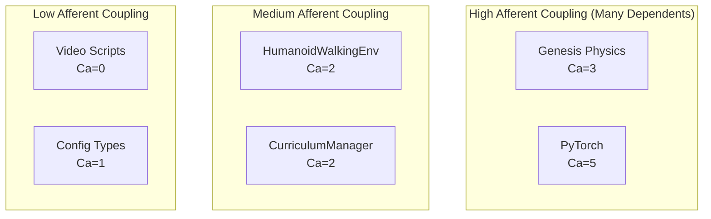
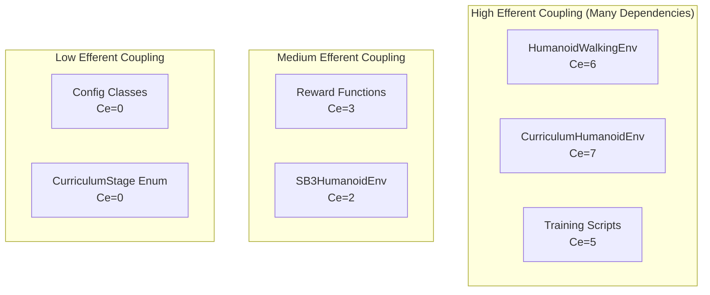
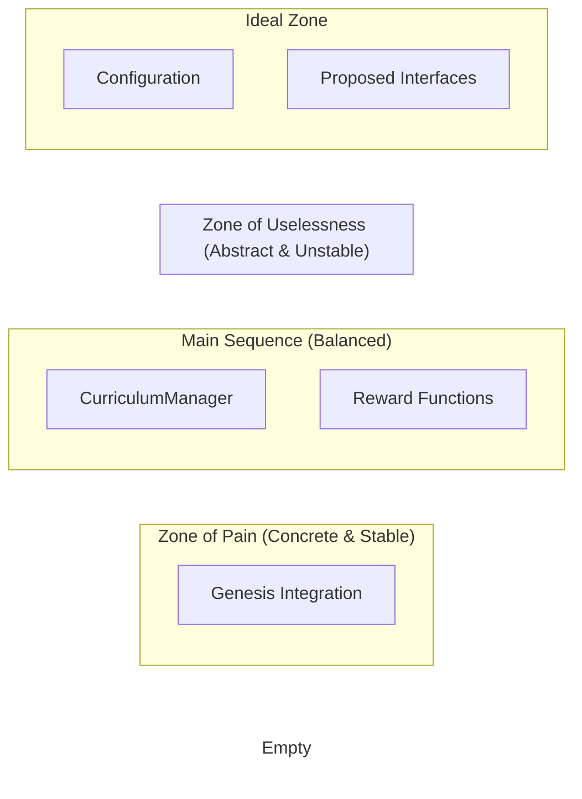

# Coupling and Cohesion Analysis

## Component Coupling Matrix

| Component | Genesis | SB3 | PyTorch | robot_grounding | Config | Rewards | Curriculum |
|-----------|---------|-----|---------|-----------------|--------|---------|------------|
| HumanoidWalkingEnv | **HIGH** | - | **MED** | **HIGH** | LOW | **HIGH** | - |
| CurriculumHumanoidEnv | **HIGH** | - | **MED** | **HIGH** | LOW | - | **HIGH** |
| SB3HumanoidEnv | - | **MED** | - | - | - | - | - |
| WalkingRewardFunction | - | - | **MED** | - | - | - | - |
| CurriculumRewardCalculator | - | - | LOW | - | - | - | **HIGH** |
| CurriculumManager | - | - | - | - | **MED** | - | - |
| Training Scripts | - | **HIGH** | - | - | **MED** | - | - |

**Legend**: HIGH = Tight Coupling, MED = Moderate Coupling, LOW = Loose Coupling

## Detailed Coupling Analysis

### 1. Afferent Coupling (Ca) - Components that depend on this module



### 2. Efferent Coupling (Ce) - Components this module depends on



## Cohesion Analysis

### High Cohesion Components ✅

1. **CurriculumManager**
   - Single Responsibility: Manages curriculum progression
   - All methods relate to curriculum state and transitions
   - Clear, focused interface

2. **WalkingRewardFunction**
   - Single Responsibility: Calculate walking rewards
   - All methods support reward computation
   - Well-defined inputs and outputs

3. **Configuration Classes**
   - Single Responsibility: Hold configuration data
   - Pure data structures with validation
   - No behavior mixing

### Low Cohesion Components ❌

1. **HumanoidWalkingEnv**
   - Multiple Responsibilities:
     - Scene management
     - Robot control
     - Physics simulation
     - Observation extraction
     - Reward calculation
     - Episode management
   - Should be split into multiple components

2. **Training Scripts**
   - Mixed concerns:
     - Environment creation
     - Algorithm configuration
     - Logging setup
     - Training loop
   - Could benefit from command pattern

## Dependency Inversion Violations

### Current Issues:

```python
# Bad: Direct concrete dependency
class HumanoidWalkingEnv:
    def __init__(self):
        self.scene = gs.Scene()  # Direct Genesis dependency
        
# Bad: Hard-coded path manipulation
sys.path.insert(0, project_root)
from robot_grounding import RobotGroundingCalculator
```

### Recommended Fixes:

```python
# Good: Dependency injection
class HumanoidWalkingEnv:
    def __init__(self, physics_engine: PhysicsEngineInterface):
        self.physics = physics_engine
        
# Good: Proper imports
from genesis_humanoid_rl.external.robot_grounding import RobotGroundingCalculator
```

## Coupling Metrics Summary

### Instability Index (I = Ce / (Ca + Ce))

| Component | Ca | Ce | Instability | Analysis |
|-----------|----|----|-------------|----------|
| HumanoidWalkingEnv | 2 | 6 | 0.75 | **Unstable** - High efferent coupling |
| CurriculumManager | 2 | 2 | 0.50 | **Balanced** - Good stability |
| Config Classes | 1 | 0 | 0.00 | **Stable** - Pure data structures |
| Training Scripts | 0 | 5 | 1.00 | **Highly Unstable** - All dependencies |

### Abstractness vs Instability Chart



## Recommendations for Reducing Coupling

### 1. Introduce Abstraction Layers

```python
# Physics abstraction
class PhysicsEngineInterface(ABC):
    @abstractmethod
    def create_robot(self, urdf_path: str) -> Robot:
        pass

# Observation abstraction  
class ObservationExtractor(ABC):
    @abstractmethod
    def extract_observation(self, robot: Robot) -> np.ndarray:
        pass
```

### 2. Use Dependency Injection Container

```python
# Dependency container
class DIContainer:
    def __init__(self):
        self.physics = GenesisPhysicsAdapter()
        self.reward_calc = WalkingRewardFunction()
        self.obs_extractor = RobotObservationExtractor()
    
    def create_environment(self) -> gym.Env:
        return HumanoidWalkingEnv(
            physics=self.physics,
            reward_calculator=self.reward_calc,
            observation_extractor=self.obs_extractor
        )
```

### 3. Event-Driven Decoupling

```python
# Event bus for curriculum
class EventBus:
    def publish(self, event: Event):
        for subscriber in self.subscribers[type(event)]:
            subscriber.handle(event)

# Decoupled curriculum progression
class CurriculumProgressionEvent:
    def __init__(self, old_stage: str, new_stage: str):
        self.old_stage = old_stage
        self.new_stage = new_stage
```

## Conclusion

The analysis reveals several coupling hotspots that should be addressed:

1. **HumanoidWalkingEnv** has the highest coupling and should be refactored
2. **Direct Genesis dependencies** create brittleness throughout the system
3. **Path manipulation** for imports indicates packaging issues
4. **Lack of interfaces** prevents proper dependency inversion

Priority should be given to introducing abstraction layers and reducing the coupling in the core environment classes.