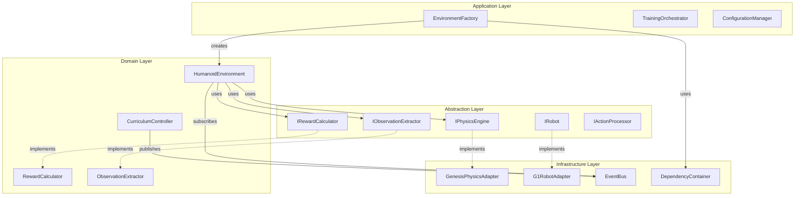

# Architecture Refactoring Proposal

## Proposed Refactored Architecture



## Code Examples for Refactoring

### 1. Physics Engine Abstraction

```python
# src/genesis_humanoid_rl/core/interfaces/physics.py
from abc import ABC, abstractmethod
from typing import Tuple, Optional
import numpy as np

class IPhysicsEngine(ABC):
    """Abstract interface for physics engines."""
    
    @abstractmethod
    def create_scene(self, config: dict) -> None:
        """Initialize physics scene."""
        pass
    
    @abstractmethod
    def add_ground_plane(self) -> None:
        """Add ground plane to scene."""
        pass
    
    @abstractmethod
    def load_robot(self, urdf_path: str, position: Tuple[float, float, float]) -> 'IRobot':
        """Load robot from URDF."""
        pass
    
    @abstractmethod
    def step_simulation(self, dt: float) -> None:
        """Advance physics simulation."""
        pass
    
    @abstractmethod
    def reset_scene(self) -> None:
        """Reset physics scene."""
        pass

class IRobot(ABC):
    """Abstract interface for robots."""
    
    @abstractmethod
    def get_position(self) -> np.ndarray:
        """Get robot base position."""
        pass
    
    @abstractmethod
    def get_orientation(self) -> np.ndarray:
        """Get robot base orientation as quaternion."""
        pass
    
    @abstractmethod
    def get_joint_positions(self) -> np.ndarray:
        """Get all joint positions."""
        pass
    
    @abstractmethod
    def get_joint_velocities(self) -> np.ndarray:
        """Get all joint velocities."""
        pass
    
    @abstractmethod
    def set_joint_targets(self, targets: np.ndarray) -> None:
        """Set joint position targets."""
        pass
    
    @abstractmethod
    def apply_joint_torques(self, torques: np.ndarray) -> None:
        """Apply torques to joints."""
        pass
```

### 2. Genesis Adapter Implementation

```python
# src/genesis_humanoid_rl/infrastructure/genesis_adapter.py
import genesis as gs
import numpy as np
from typing import Tuple
from ..core.interfaces.physics import IPhysicsEngine, IRobot

class GenesisPhysicsAdapter(IPhysicsEngine):
    """Adapter for Genesis physics engine."""
    
    def __init__(self):
        self.scene = None
        self.initialized = False
    
    def create_scene(self, config: dict) -> None:
        """Initialize Genesis scene."""
        if not self.initialized:
            gs.init()
            self.initialized = True
        
        self.scene = gs.Scene(
            sim_options=gs.options.SimOptions(
                dt=config.get('dt', 0.01),
                substeps=config.get('substeps', 10)
            ),
            show_viewer=config.get('show_viewer', False)
        )
    
    def add_ground_plane(self) -> None:
        """Add ground plane."""
        if self.scene:
            self.scene.add_entity(gs.morphs.Plane())
    
    def load_robot(self, urdf_path: str, position: Tuple[float, float, float]) -> 'GenesisRobotAdapter':
        """Load robot and return adapter."""
        genesis_robot = self.scene.add_entity(
            gs.morphs.URDF(
                file=urdf_path,
                pos=position,
                euler=(0, 0, 0)
            )
        )
        self.scene.build()
        return GenesisRobotAdapter(genesis_robot)
    
    def step_simulation(self, dt: float) -> None:
        """Step Genesis simulation."""
        if self.scene:
            self.scene.step()
    
    def reset_scene(self) -> None:
        """Reset the scene."""
        # Genesis handles this internally
        pass

class GenesisRobotAdapter(IRobot):
    """Adapter for Genesis robot."""
    
    def __init__(self, genesis_robot):
        self.robot = genesis_robot
    
    def get_position(self) -> np.ndarray:
        """Get position as numpy array."""
        return self.robot.get_pos().cpu().numpy()
    
    def get_orientation(self) -> np.ndarray:
        """Get quaternion as numpy array."""
        return self.robot.get_quat().cpu().numpy()
    
    def get_joint_positions(self) -> np.ndarray:
        """Get joint positions."""
        return self.robot.get_dofs_position().cpu().numpy()
    
    def get_joint_velocities(self) -> np.ndarray:
        """Get joint velocities."""
        return self.robot.get_dofs_velocity().cpu().numpy()
    
    def set_joint_targets(self, targets: np.ndarray) -> None:
        """Set position targets."""
        import torch
        device = self.robot.get_dofs_position().device
        target_tensor = torch.tensor(targets, dtype=torch.float32, device=device)
        self.robot.control_dofs_position(target_tensor)
    
    def apply_joint_torques(self, torques: np.ndarray) -> None:
        """Apply torques."""
        import torch
        device = self.robot.get_dofs_position().device
        torque_tensor = torch.tensor(torques, dtype=torch.float32, device=device)
        self.robot.control_dofs_force(torque_tensor)
```

### 3. Refactored Environment with Dependency Injection

```python
# src/genesis_humanoid_rl/environments/humanoid_environment.py
import numpy as np
import gymnasium as gym
from gymnasium import spaces
from typing import Optional, Tuple, Dict, Any

from ..core.interfaces.physics import IPhysicsEngine, IRobot
from ..core.interfaces.observation import IObservationExtractor
from ..core.interfaces.reward import IRewardCalculator
from ..core.interfaces.action import IActionProcessor
from ..core.events import EventBus, EpisodeEndEvent, StepEvent

class HumanoidEnvironment(gym.Env):
    """Refactored humanoid environment with dependency injection."""
    
    def __init__(
        self,
        physics_engine: IPhysicsEngine,
        observation_extractor: IObservationExtractor,
        reward_calculator: IRewardCalculator,
        action_processor: IActionProcessor,
        event_bus: Optional[EventBus] = None,
        config: Optional[Dict[str, Any]] = None
    ):
        """Initialize with injected dependencies."""
        self.physics = physics_engine
        self.obs_extractor = observation_extractor
        self.reward_calc = reward_calculator
        self.action_proc = action_processor
        self.event_bus = event_bus or EventBus()
        self.config = config or {}
        
        # Environment configuration
        self.episode_length = self.config.get('episode_length', 1000)
        self.current_step = 0
        
        # Robot will be initialized in reset
        self.robot: Optional[IRobot] = None
        
        # Define spaces
        self.action_space = spaces.Box(
            low=-1.0, high=1.0,
            shape=(self.config.get('num_actions', 35),),
            dtype=np.float32
        )
        
        self.observation_space = spaces.Box(
            low=-np.inf, high=np.inf,
            shape=(self.config.get('obs_dim', 113),),
            dtype=np.float32
        )
    
    def reset(self, seed: Optional[int] = None, options: Optional[Dict] = None) -> Tuple[np.ndarray, Dict]:
        """Reset environment with clean separation of concerns."""
        super().reset(seed=seed)
        
        # Reset physics
        self.physics.reset_scene()
        self.physics.create_scene(self.config.get('physics_config', {}))
        self.physics.add_ground_plane()
        
        # Load robot
        urdf_path = self.config.get('robot_urdf', 'assets/robots/g1/g1_29dof.urdf')
        initial_pos = self._get_initial_position()
        self.robot = self.physics.load_robot(urdf_path, initial_pos)
        
        # Let physics settle
        for _ in range(10):
            self.physics.step_simulation(0.01)
        
        # Reset components
        self.reward_calc.reset()
        self.obs_extractor.reset()
        self.action_proc.reset()
        
        # Get initial observation
        observation = self.obs_extractor.extract_observation(self.robot)
        
        # Reset episode tracking
        self.current_step = 0
        
        # Publish reset event
        self.event_bus.publish(EpisodeEndEvent(
            episode_length=0,
            total_reward=0.0,
            reason="reset"
        ))
        
        return observation, {}
    
    def step(self, action: np.ndarray) -> Tuple[np.ndarray, float, bool, bool, Dict]:
        """Execute environment step with clean interfaces."""
        # Process action through action processor
        processed_action = self.action_proc.process_action(action, self.robot)
        
        # Apply action to robot
        self.robot.set_joint_targets(processed_action)
        
        # Step physics simulation
        dt = 1.0 / self.config.get('control_freq', 20)
        self.physics.step_simulation(dt)
        
        # Extract observation
        observation = self.obs_extractor.extract_observation(self.robot)
        
        # Calculate reward
        reward_info = self.reward_calc.calculate_reward(
            robot=self.robot,
            action=action,
            previous_observation=self.obs_extractor.get_previous_observation()
        )
        reward = reward_info['total_reward']
        
        # Check termination
        terminated = self._check_termination()
        truncated = self.current_step >= self.episode_length
        
        # Update step counter
        self.current_step += 1
        
        # Publish step event
        self.event_bus.publish(StepEvent(
            step_count=self.current_step,
            reward=reward,
            observation=observation,
            action=action
        ))
        
        # Compile info
        info = {
            'step': self.current_step,
            'reward_components': reward_info,
            'terminated_reason': self._get_termination_reason() if terminated else None
        }
        
        return observation, reward, terminated, truncated, info
    
    def _get_initial_position(self) -> Tuple[float, float, float]:
        """Get initial robot position."""
        return (0.0, 0.0, 1.0)
    
    def _check_termination(self) -> bool:
        """Check termination conditions."""
        pos = self.robot.get_position()
        
        # Height check
        if pos[2] < 0.3:
            return True
        
        # Boundary check
        if abs(pos[0]) > 10.0 or abs(pos[1]) > 5.0:
            return True
        
        return False
    
    def _get_termination_reason(self) -> str:
        """Get termination reason."""
        pos = self.robot.get_position()
        
        if pos[2] < 0.3:
            return "fallen"
        elif abs(pos[0]) > 10.0 or abs(pos[1]) > 5.0:
            return "out_of_bounds"
        
        return "unknown"
```

### 4. Environment Factory with Dependency Injection

```python
# src/genesis_humanoid_rl/factories/environment_factory.py
from typing import Dict, Any, Optional
import gymnasium as gym

from ..infrastructure.genesis_adapter import GenesisPhysicsAdapter
from ..domain.observation_extractor import RobotObservationExtractor
from ..domain.reward_calculator import WalkingRewardCalculator
from ..domain.action_processor import JointPositionProcessor
from ..environments.humanoid_environment import HumanoidEnvironment
from ..core.events import EventBus

class EnvironmentFactory:
    """Factory for creating environments with proper dependency injection."""
    
    def __init__(self, event_bus: Optional[EventBus] = None):
        self.event_bus = event_bus or EventBus()
        self._physics_engines = {
            'genesis': GenesisPhysicsAdapter
        }
        self._observation_extractors = {
            'default': RobotObservationExtractor
        }
        self._reward_calculators = {
            'walking': WalkingRewardCalculator
        }
        self._action_processors = {
            'position': JointPositionProcessor
        }
    
    def create_environment(
        self,
        env_type: str = 'humanoid_walking',
        physics_backend: str = 'genesis',
        config: Optional[Dict[str, Any]] = None
    ) -> gym.Env:
        """Create environment with specified configuration."""
        config = config or {}
        
        # Create physics engine
        physics_class = self._physics_engines.get(physics_backend)
        if not physics_class:
            raise ValueError(f"Unknown physics backend: {physics_backend}")
        physics_engine = physics_class()
        
        # Create components based on environment type
        if env_type == 'humanoid_walking':
            obs_extractor = self._observation_extractors['default'](
                config.get('observation_config', {})
            )
            reward_calc = self._reward_calculators['walking'](
                config.get('reward_config', {})
            )
            action_proc = self._action_processors['position'](
                config.get('action_config', {})
            )
        else:
            raise ValueError(f"Unknown environment type: {env_type}")
        
        # Create environment with injected dependencies
        return HumanoidEnvironment(
            physics_engine=physics_engine,
            observation_extractor=obs_extractor,
            reward_calculator=reward_calc,
            action_processor=action_proc,
            event_bus=self.event_bus,
            config=config
        )
    
    def register_physics_engine(self, name: str, engine_class: type):
        """Register custom physics engine."""
        self._physics_engines[name] = engine_class
    
    def register_reward_calculator(self, name: str, calculator_class: type):
        """Register custom reward calculator."""
        self._reward_calculators[name] = calculator_class
```

### 5. Event-Driven Curriculum System

```python
# src/genesis_humanoid_rl/core/events.py
from abc import ABC
from typing import Any, Dict, List, Callable
from dataclasses import dataclass

class Event(ABC):
    """Base event class."""
    pass

@dataclass
class CurriculumStageChangedEvent(Event):
    """Event fired when curriculum stage changes."""
    old_stage: str
    new_stage: str
    episode_count: int
    average_reward: float

@dataclass
class EpisodeEndEvent(Event):
    """Event fired when episode ends."""
    episode_length: int
    total_reward: float
    reason: str

@dataclass
class StepEvent(Event):
    """Event fired on each environment step."""
    step_count: int
    reward: float
    observation: Any
    action: Any

class EventBus:
    """Simple event bus implementation."""
    
    def __init__(self):
        self._subscribers: Dict[type, List[Callable]] = {}
    
    def subscribe(self, event_type: type, handler: Callable):
        """Subscribe to event type."""
        if event_type not in self._subscribers:
            self._subscribers[event_type] = []
        self._subscribers[event_type].append(handler)
    
    def publish(self, event: Event):
        """Publish event to subscribers."""
        event_type = type(event)
        if event_type in self._subscribers:
            for handler in self._subscribers[event_type]:
                handler(event)

# Usage example
class CurriculumController:
    """Refactored curriculum controller using events."""
    
    def __init__(self, event_bus: EventBus):
        self.event_bus = event_bus
        self.event_bus.subscribe(EpisodeEndEvent, self._on_episode_end)
        self.current_stage = "balance"
        self.episode_rewards = []
    
    def _on_episode_end(self, event: EpisodeEndEvent):
        """Handle episode end event."""
        self.episode_rewards.append(event.total_reward)
        
        # Check for stage advancement
        if self._should_advance():
            old_stage = self.current_stage
            self.current_stage = self._get_next_stage()
            
            # Publish stage change event
            self.event_bus.publish(CurriculumStageChangedEvent(
                old_stage=old_stage,
                new_stage=self.current_stage,
                episode_count=len(self.episode_rewards),
                average_reward=sum(self.episode_rewards[-50:]) / min(50, len(self.episode_rewards))
            ))
```

### 6. Improved Configuration with Validation

```python
# src/genesis_humanoid_rl/config/validated_config.py
from pydantic import BaseModel, Field, validator
from typing import Optional, List, Dict, Any

class PhysicsConfig(BaseModel):
    """Validated physics configuration."""
    dt: float = Field(0.01, gt=0, le=0.1)
    substeps: int = Field(10, ge=1, le=50)
    show_viewer: bool = False
    
    @validator('dt')
    def validate_timestep(cls, v):
        if v > 0.05:
            raise ValueError("Timestep too large for stable simulation")
        return v

class RewardConfig(BaseModel):
    """Validated reward configuration."""
    velocity_weight: float = Field(1.0, ge=0)
    stability_weight: float = Field(0.5, ge=0)
    energy_weight: float = Field(-0.1, le=0)
    height_weight: float = Field(0.3, ge=0)
    
    target_velocity: float = Field(1.0, ge=0, le=5.0)
    target_height: float = Field(0.8, ge=0.5, le=1.5)
    
    @validator('target_velocity')
    def validate_velocity(cls, v):
        if v > 3.0:
            print("Warning: Target velocity > 3.0 m/s may be unrealistic")
        return v

class EnvironmentConfig(BaseModel):
    """Complete validated environment configuration."""
    physics: PhysicsConfig = PhysicsConfig()
    reward: RewardConfig = RewardConfig()
    
    episode_length: int = Field(1000, ge=100, le=10000)
    control_freq: int = Field(20, ge=10, le=100)
    num_actions: int = Field(35, ge=1)
    obs_dim: int = Field(113, ge=1)
    
    robot_urdf: str = "assets/robots/g1/g1_29dof.urdf"
    
    class Config:
        json_encoders = {
            # Add custom encoders if needed
        }

# Usage
def load_validated_config(config_path: str) -> EnvironmentConfig:
    """Load and validate configuration."""
    import json
    
    with open(config_path, 'r') as f:
        config_dict = json.load(f)
    
    # Pydantic will validate and provide helpful error messages
    return EnvironmentConfig(**config_dict)
```

## Migration Strategy

### Phase 1: Introduce Abstractions (Week 1-2)
1. Create interface definitions
2. Implement adapters for existing code
3. No behavioral changes

### Phase 2: Refactor Core Components (Week 3-4)
1. Refactor HumanoidWalkingEnv using new interfaces
2. Update reward and observation systems
3. Maintain backward compatibility

### Phase 3: Implement Event System (Week 5)
1. Add event bus infrastructure
2. Migrate curriculum to event-driven
3. Add comprehensive logging

### Phase 4: Complete Migration (Week 6)
1. Update all training scripts
2. Remove old code
3. Update documentation

## Benefits of Refactoring

1. **Testability**: Can mock physics engine for unit tests
2. **Extensibility**: Easy to add new physics engines or robots
3. **Maintainability**: Clear separation of concerns
4. **Flexibility**: Event-driven architecture enables plugins
5. **Robustness**: Validated configurations prevent errors

This refactoring transforms the codebase from a research prototype to a production-ready framework while maintaining all existing functionality.